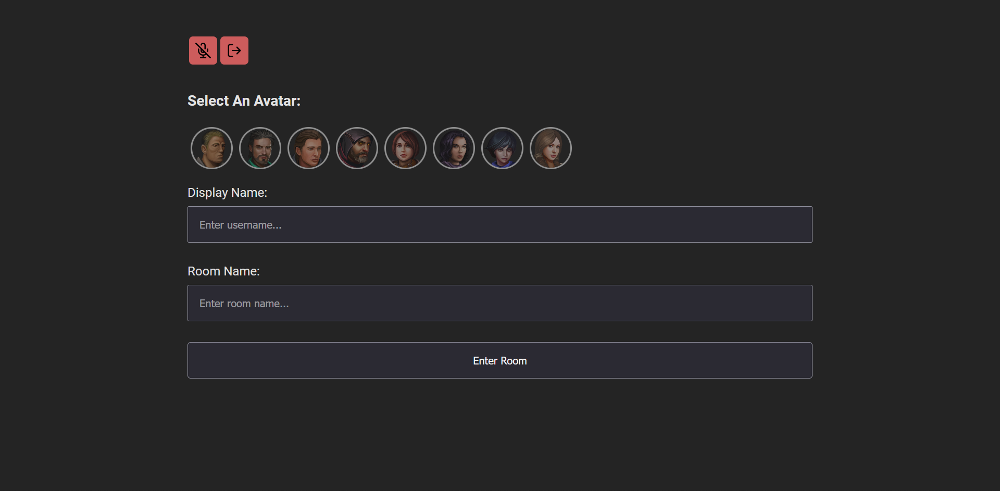

# Description

The Voice Rooms Program is an interactive platform designed to enhance player communication by allowing users to join dedicated voice rooms. This program aims to facilitate real-time audio interaction among players in a seamless and user-friendly manner.
21
