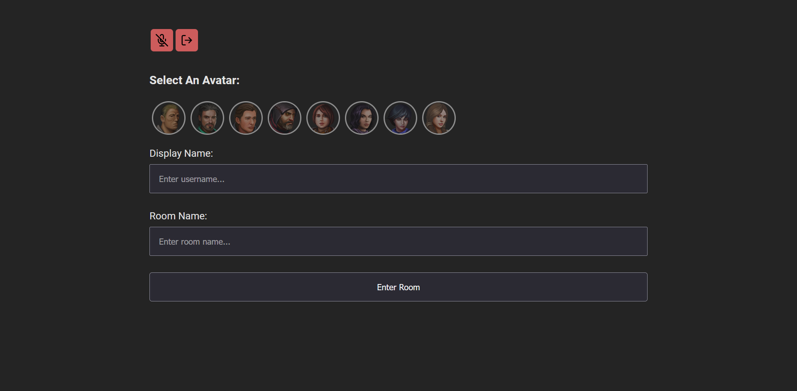

# Voice Rooms

A real-time browser-based voice chat app built with [Agora RTC/RTM](https://www.agora.io/) and [Vite](https://vitejs.dev/). Users pick an avatar, enter a display name, and join a named room to talk with anyone else in that room — no account or download required.

## Features

- Create or join named voice rooms via URL (`?room=roomname`)
- Real-time audio with live speaking indicators
- Avatar selection with per-user visual presence
- Mute/unmute toggle
- Instant room join/leave

## Tech Stack

- **Frontend:** Vanilla JS, Vite
- **Voice/Messaging:** Agora RTC SDK (`agora-rtc-sdk-ng`), Agora RTM SDK (`agora-rtm-sdk`)

## Getting Started

### Prerequisites

- Node.js 18+
- An [Agora account](https://console.agora.io/) with an App ID

### Installation

```bash
git clone https://github.com/Giddy-K/voice-rooms.git
cd voice-rooms
npm install
```

### Configuration

Copy `.env.example` to `.env` and fill in your Agora App ID:

```bash
cp .env.example .env
```

```env
VITE_AGORA_APP_ID=your_agora_app_id_here
```

### Running locally

```bash
npm run dev
```

### Building for production

```bash
npm run build
```

## Deployment

The project is configured for [Vercel](https://vercel.com/). Set the `VITE_AGORA_APP_ID` environment variable in your Vercel project settings before deploying.

## Usage

1. Open the app in your browser
2. Select an avatar and enter a display name
3. Enter a room name (or share a URL with `?room=yourroom`)
4. Click **Enter Room** — your mic starts muted
5. Click the mic icon to unmute and speak
6. Click the leave icon to exit the room
